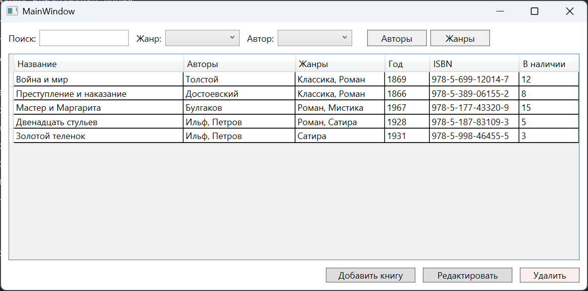
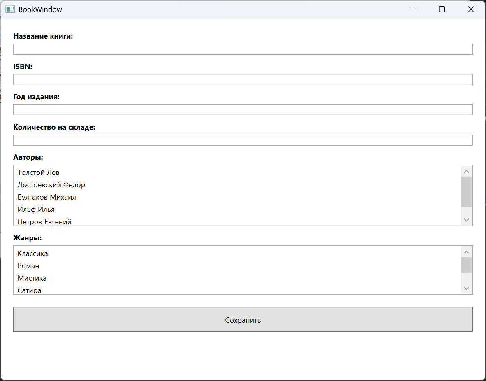
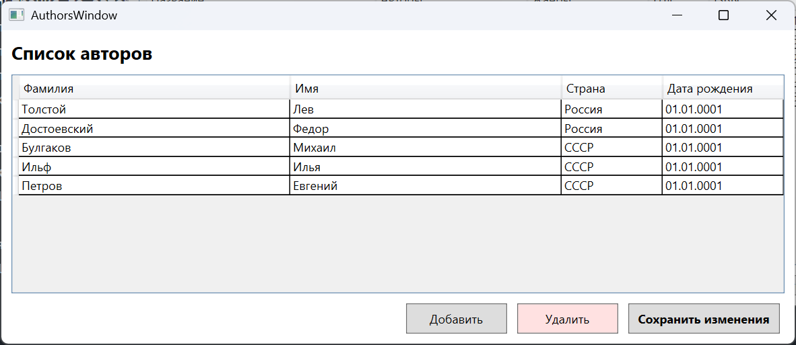
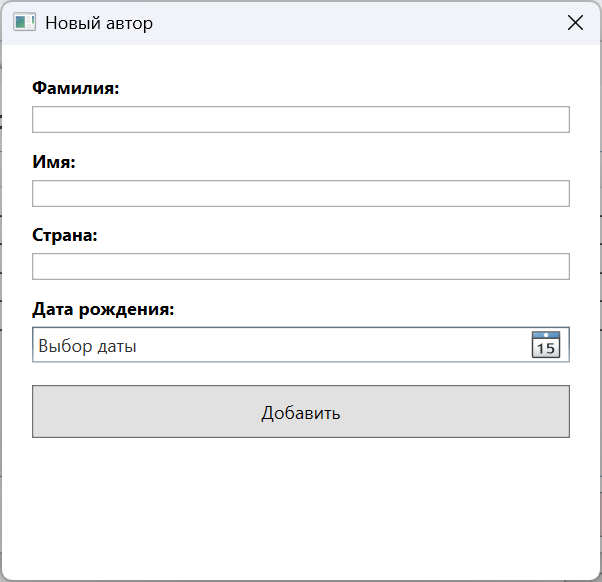
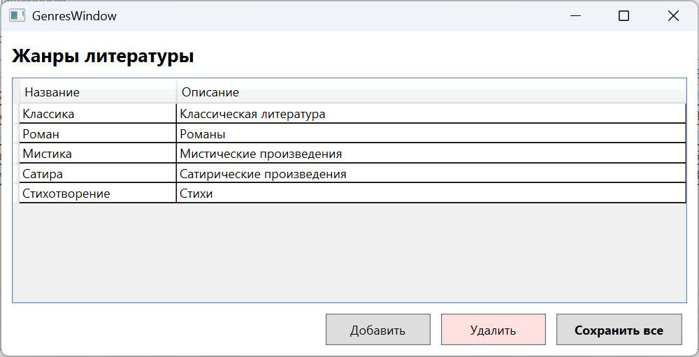
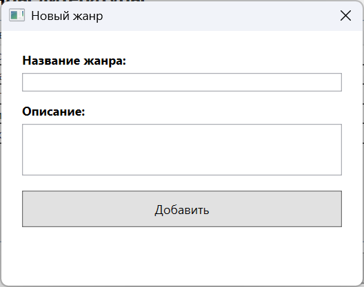

# Практическое задание "Управление библиотекой книг"  
## Приложение для управления небольшой библиотекой с использованием Entity Framework Core и WPF.  
### Выполнены следующие требования:  
- Проверяем, что Book, Author, Genre созданы.  
- Созданы и настроены связи с ограничениями.  
- Выполнена миграция и создана база данных.  
- Главное окно отображает список книг с авторами и жанрами.  
- Работает поиск по названию книги.  
- Работает фильтрация по автору и жанру.  
- Есть окно для добавления / редактирования книги. Тут не забываем, что должен работать выбор автора и жанра из списка.  
- Есть окно для управления авторами.  
- Есть окно для управления жанрами.  
- Количество книг «в наличии» отображается в главной таблице.  

## Ниже приведен результат программы  
### Главное окно:

### Добавления/редактирования книги:

### Список авторов:

### Добавление автора:

### Список жанров:

### Добавление жанра

